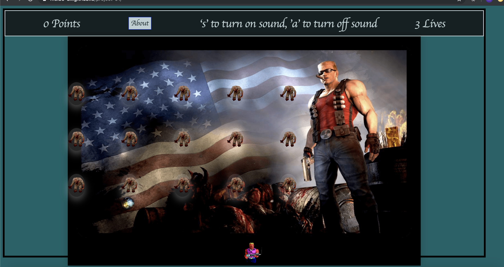
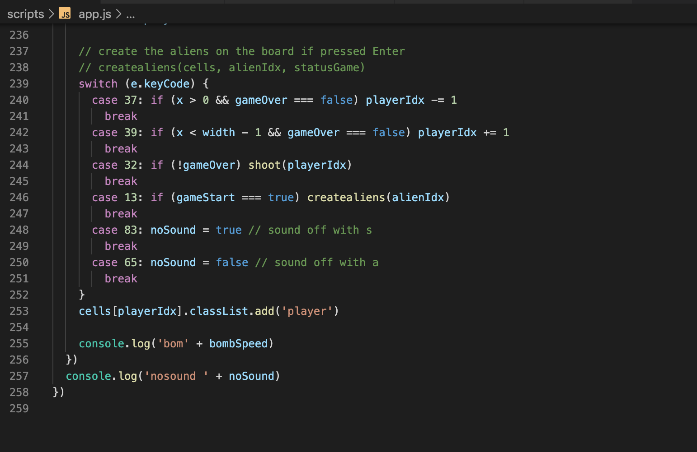

# project-01
a JS game project

# Duke Nukem Space Invaders Game.
This game is a space Invaders clone made with JavaScript HTML and CSS. It was the first project and the task was to use the grid technology to create a game with a win and a loos situation as MVP. 

## The process
To start with was to get something on the screen to move when a key was pressed. To do this I build a grid and put in a colored dot to move around. This were the easy part. Next step , the "bullet" fire an collision. Moving "aliens" bacame a bit complex  mostly for creating all in one array only. This array have to take care of all moving parts and collisions in the game.

## The game
This game has 4 moving parts. Player witch is moving only on the lower line from left to right and 
shoot a bullet from the bottom to the top of the gameboard. Only one "bullet" can shot a the time, in this way I make the game a bit more difficult. 
Alians is moving from left to right and towards the bottom one grid at the time. Alians is all moving in same time with an increased speed for every time all alians shut. 
When a bullet hit an alian the alian is removed from the board. When alian reach close enough to the bottom they will release a bomb that will kill the player if collison is detected. If the player is not able to shoot all alians before they reach the bottom of the board they will take one life for each alian that comes in collition with the player. Player looses when been in collition 3 times with a bomb or alian. 

## Scoreboard
There is no real winning but a highscore that indicate how many points the player got. Right coner indicates the lives for the player count down from 3.
The button in the middle will send the user to the wiki page for the Duke Nukem.   

## Challanges 
Most of my challanges came with the timing. I had to find where the moving part would go next to keep track of when to "kill" the alian. This check I had to make in the components itself. For this to happen i had to create 4 main components to control the moving parts.
The styling was a big challange for me becouse of the grid layout. I did try to create a layer on top of it but that moved all other parts on the screen. I ran out of time and had to make it simpler to finish the game and to a playable state.

## Controls
Control was only done by key-press. All keys is made in one switch function to make it easy to expand. The disavanges by this way is only 
one key can be read at the time. I used the hex code from the keyboard input to set witch key is pressed. 

hex code 13 = enter to start the game
hex code 32 = spacebar to shoot
hex code 83 = s for sound off
hex code 65 = a for sound on

 

## Key leanings
JavaScript is a language that works very good wirh the browser to create responsive apps in the web browser. The styling in CSS does makes it a bit more difficult to keep track of what is going on.
